============================================================
101 iWoT Hello! - LED 燈控制 - 以 LinkIt Smart 7688 Duo 為例
============================================================

    :Date: <2016-12-29 四 11:43>

.. contents::

Tutorial 101/102/103/104 課程將帶領讀者透過實作來操控 LED 與手機及磁簧開關互動，達到物與物之間的聯動

.. raw:: html

    
iWoT 101/102/103/104 demo video - 成果預覽 
    <embed src="http://www.youtube.com/v/ogHW8F4Eshs&autoplay=0" border=1 type="application/x-shockwave-flash" wmode="transparent" width="600" height="480"></embed>

前置工作
--------

在開始前，您將需要先準備下列裝置與電子材料：

- LinkIt Smart 7688 Duo

- 麵包板 × 1(塊)

- LED燈(KY-009 3-color) × 1(組)

- 杜邦線 × 1(包)

  .. image:: ./images-101/led.jpg
      :alt: LED Connect to Duo
      :align: center

LED 線路圖
~~~~~~~~~~

將 LinkIt Smart 7688 Duo 接上 LED 燈的裝置，其線路圖如下所示：

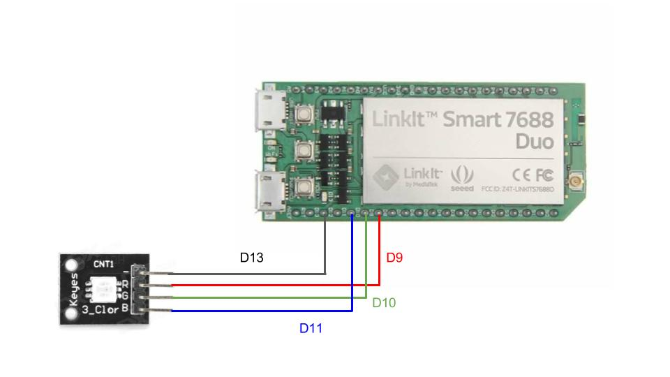

將 LED 接腳分別接到 7688 上的 D13 D9 D10 D11，其功用說明如下：

- D13 - VCC 3V 接到 LED V

- D9 - PWN 接到 LED R (紅色)

- D10 - PWN 接到 LED G (綠色)

- D11 - PWN 接到 LED B (籃色)

.. _make-duo-device-id:

生成 7688 Duo 的 Device ID
~~~~~~~~~~~~~~~~~~~~~~~~~~

LinkIt Smart 7688 Duo 剛買回來需產生一組不重複的 ID 對應於 iWoT 上，其步驟如下：

- 設定 7688 Duo 並接上網路

- 取得該 7688 Duo 的 Device ID (每個裝置 ID 是不重複的惟一值)

7688 Duo 接上網路
^^^^^^^^^^^^^^^^^

- 回復原廠設定 /(如果您的 7688 為全新未使用可跳過此步驟)/

  - 將 LinkIt Smart 7688 Duo 插上電源後靜置一段時間讓它完成開機。

  - 按下 Wifi 鍵 (三個按鈕中間那顆) 20 秒。

  - 放開後，看到橘色燈閃爍代表 reset 中。

  - 靜置一段時間後，用電腦觀察是否有新的 ``LinkIt_smart_7688_XXXX`` Wifi AP，若有即代表完成。

- 設定 Wifi 連線

  - 參閱 LinkIt Smart 7688 Duo `官方文件 <https://labs.mediatek.com/fileMedia/download/4ef033b8-80ca-4cdb-9ad6-1c23836c63de>`_ ，設定登入密碼並將裝置連上 Wifi 網路。

產生 Device ID
^^^^^^^^^^^^^^

- 從 Windows 透過 `PuTTY <http://www.chiark.greenend.org.uk/~sgtatham/putty/download.html>`_ 遠端登入 LinkIt Smart 7688 Duo。

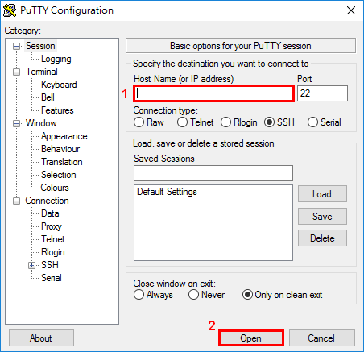

::

    login as: root
    root@192.168.xxx.xxx's password:<key-in password>

- 如下圖所示：下載執行 setup.sh 並取得裝置 ID 並記錄下來，之後設定時會用到

::

    $ wget -q -O- http://rc1.iwot.io/7688duo/setup.sh | sh

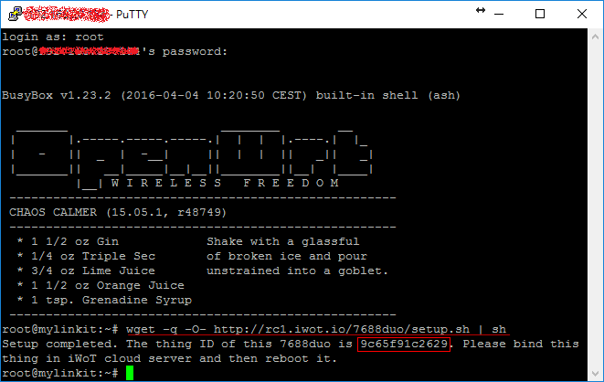

四個步驟建立 iWoT 裝置
----------------------

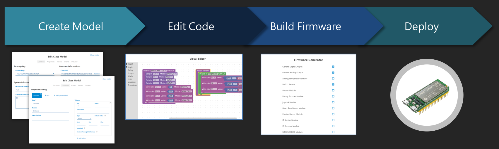

- 建立 Web Thing Model

- Visual Editor 撰寫 device 控制邏輯

- 線上產生 Arduino Firmware

- 佈署到 iWoT 裝置

建立 LED Web Thing Model
~~~~~~~~~~~~~~~~~~~~~~~~

關於 LED 的 Web Thing Model 定義，主要填寫 [Common] 與 [Actions] 這二項。[Common] 欄位中必需填寫 Class ID、Firmwave Version 這兩個值。此外由於 LED 硬體特性只有 Actions 屬性，故在此定義 LED brightness 亮度這個變數，其可調範圍介於 0 ~ 255 之間。

- [Common] 定義 Class ID 及 Firmware Version

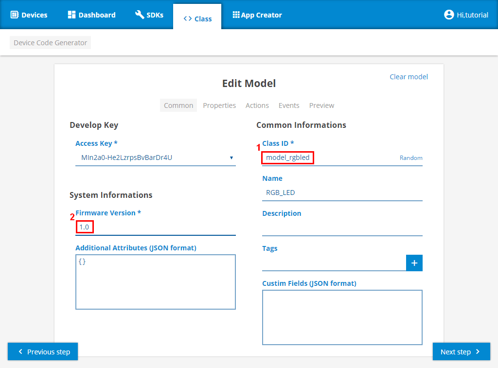

- [Actions] 定義 brightness 這個可控變數，範圍 0 ~ 255

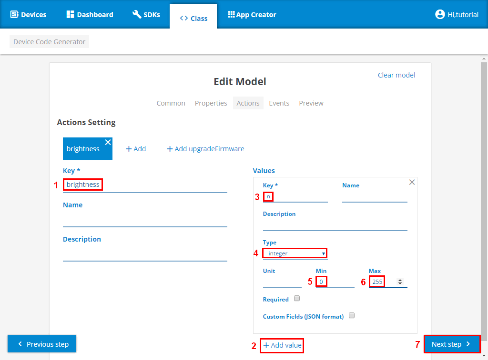

Visual Editor 撰寫 LED 控制邏輯
~~~~~~~~~~~~~~~~~~~~~~~~~~~~~~~

LED 程式撰寫上，主要分兩部份

- LED board initialize ，硬體初始化工作

  - 將 D13 VCC 3V 設定為 Output/DIGTAL

  - 將 D9/D10/D11 分別設為 PWN/ANALOG

- LED 邏輯控制

  - 將 Web Thing Model 所定義的外部可操控變數 brightness 指定為 n ，分別寫入代表 RGB 的 D9/D10/D11。

程式邏輯如下圖：

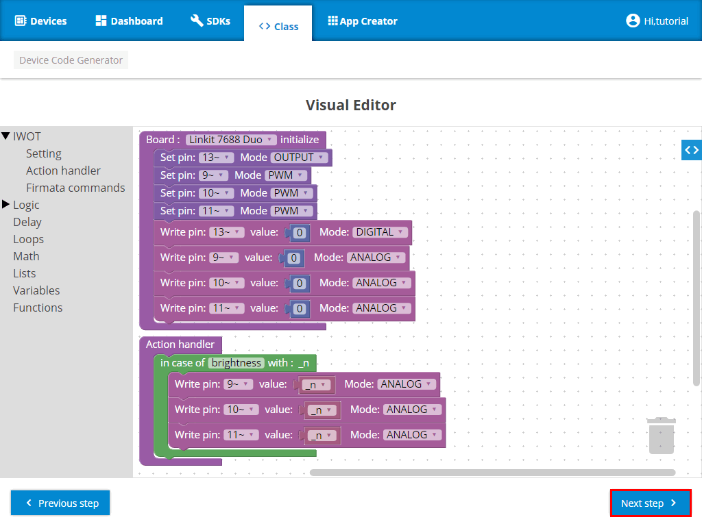

產生 Arduino Firmware
~~~~~~~~~~~~~~~~~~~~~

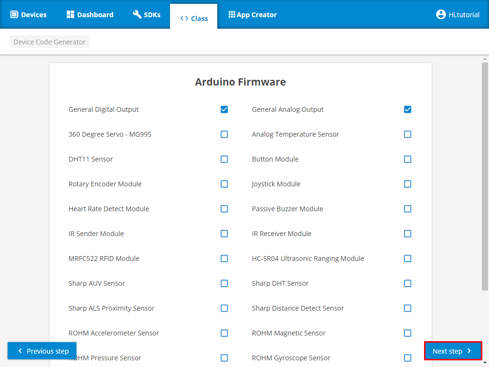

OTA 發佈到 iWoT
~~~~~~~~~~~~~~~

上述撰寫的程式邏輯及建立的 Arduino Firmware 將透過 OTA 發佈到 iWoT 的裝制上，這過程需要數分鐘的時間。OTA 完成後，將會在 iWoT 平台的上看見它出現在 device 列表中。詳細步驟如下：

- 將 Device ID 加到 LED Class (輸入先前準備工作所記錄下來的裝置 ID)

- 將 7688 Duo 接上電源開機 (等待程式安裝，其過程需等待數分鐘時間)

- 在 iWoT 平台 Devices 列表頁面，看見裝置已經成功連上

將 Device ID 加到 LED Class

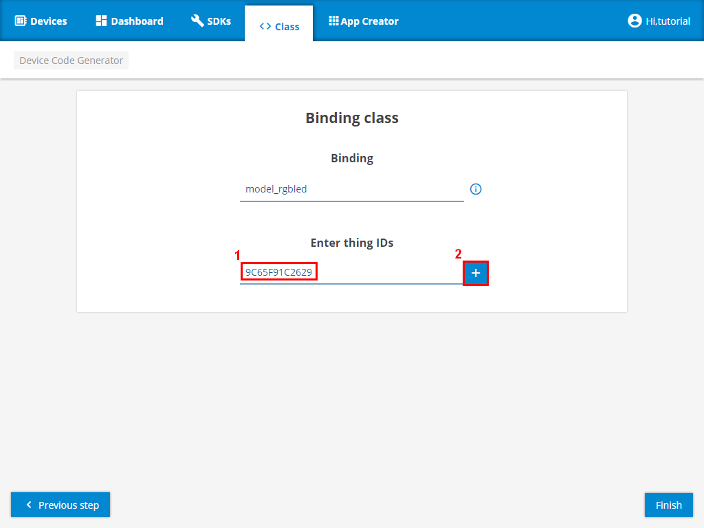

LED 出現於裝置列表上

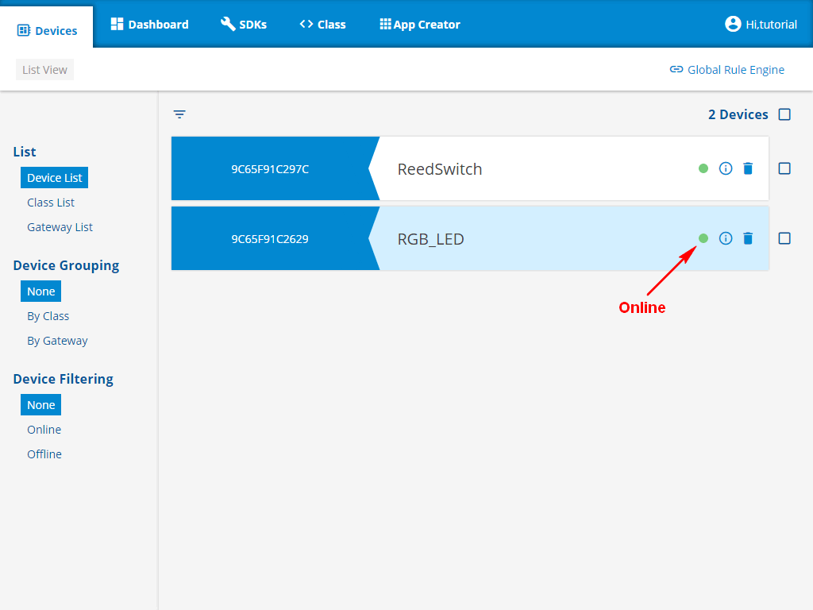

透過 Rule Engine 測試 iWoT LED 燈
---------------------------------

最後我們可以透過 Rule Engine 測試 iWoT LED 的動作看看是否正確無誤。如有錯誤請回到 Visual Editor 檢查你的程式邏輯，也可透過再次修改 Visual Editor 來重新改寫 LED 控制邏輯。

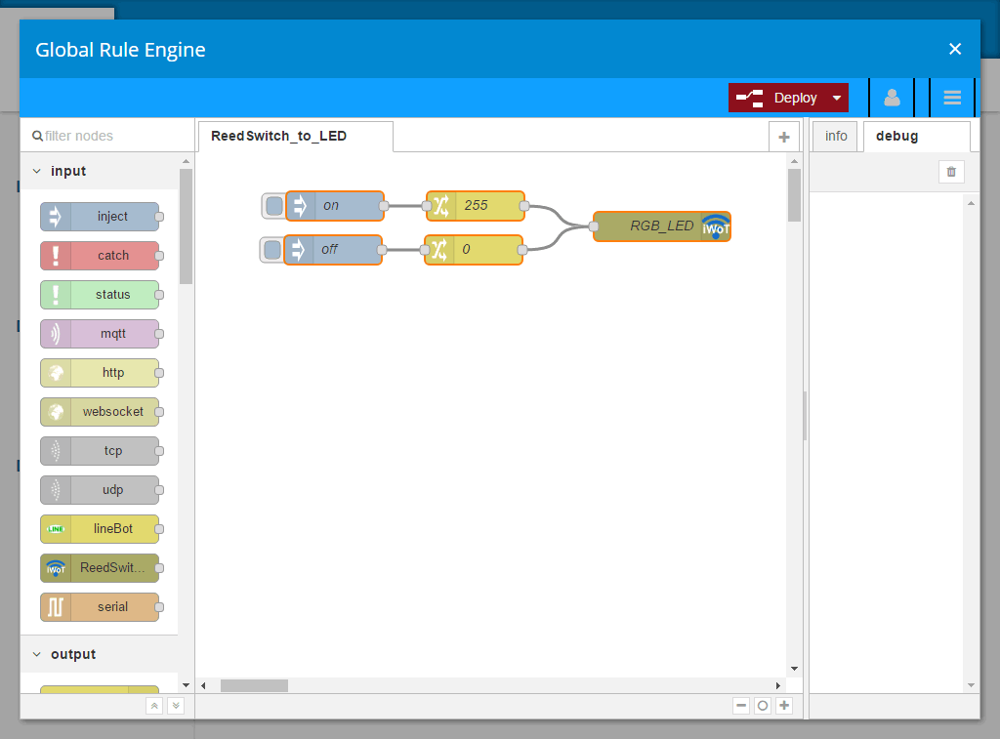

影片 - 實作過程記錄
-------------------

.. raw:: html

    
101 iWoT Hello! Create LED Thing 實作過程記錄 
    <embed alt="kk fydfd sjkfds" src="http://www.youtube.com/v/UfmnHPLLiZw&autoplay=0" type="application/x-shockwave-flash" wmode="transparent" width="600" height="480"></embed> <!-- 425 350 -->

透過 Visual Editor 改變 LED 燈的顏色
------------------------------------

LED 原先設計是亮白色燈光，透過 iWoT 的 Visual Editor 可將原本 LED 白色燈光改換成紅色燈光。修改步驟如下：

A. 點擊 class 進入 Model list 按下修改 button 進行 ``model_rgbled`` 的修改
#. 按下 [Next step]，略過 Edit Model
#. Visual Editor 頁面中，將 Action handler 中 Write Pin 10/11 設為 0
#. 按下 [Next step]，略過 Arduino Firmware 頁面(若有要增加 Firmware 可自行勾選)
#. 按下 [Finish]，略過 Binding class (若之後需增加 Thing 可自行添加 Device ID)
#. Popup Success 畫面按下 [OK] 即可完成了 LED 改變亮燈的顏色

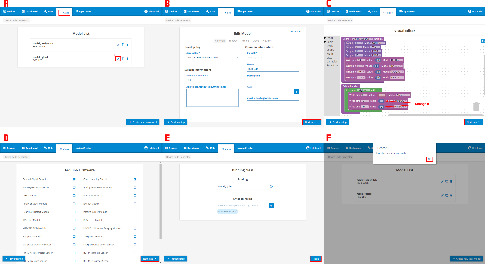

RGB 分別為 Pin9 紅色、 Pin10 綠色、 Pin11 藍色。在步驟 C 的 Visual Editor 中，將 Action handler 裏的 Write Pin10 以及 Pin11 給定常數值 0。這讓 Pin 10/11 為 0 ，表示綠藍不發光，LED 之後將只發紅光。

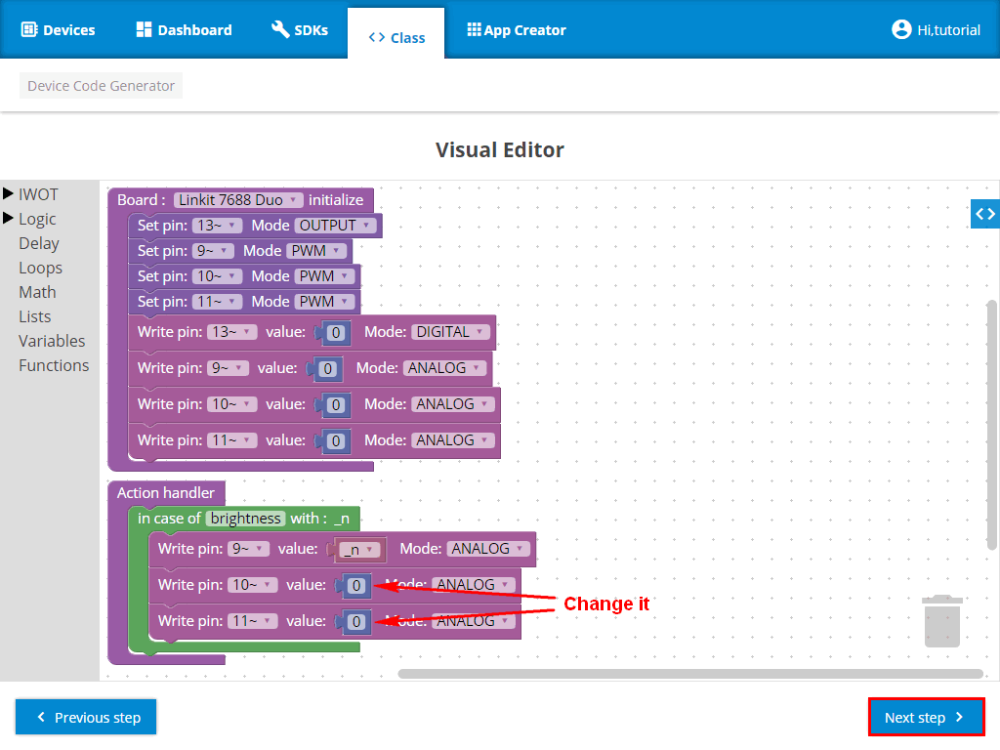

接下來的 102 將介紹如何實作磁簧開關並與 LED 燈互動。
