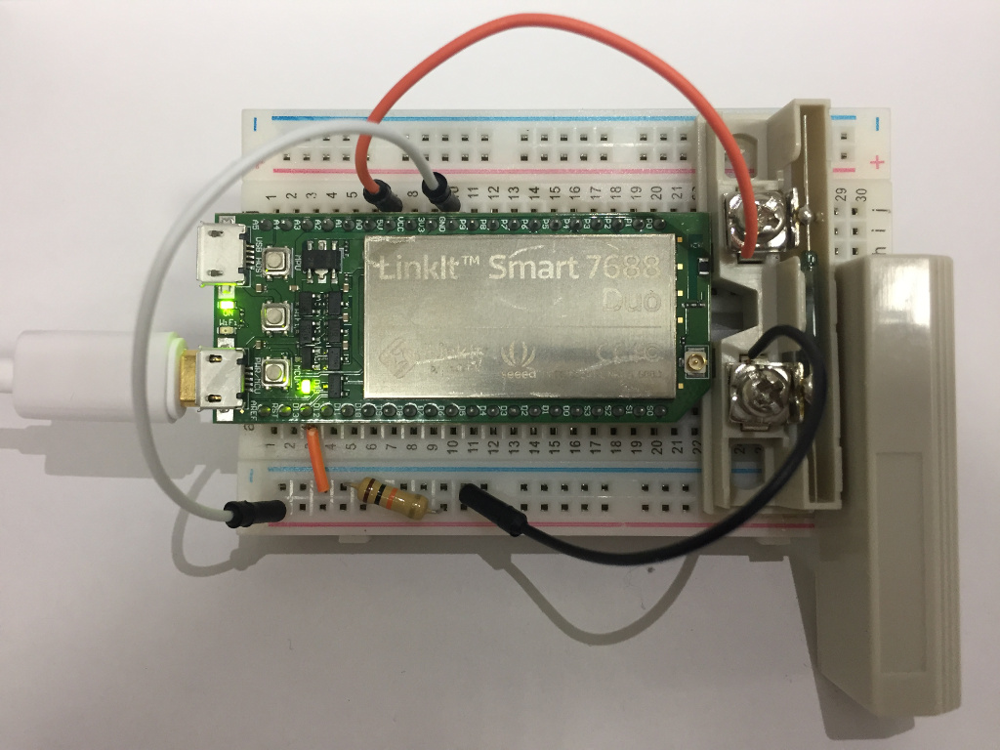
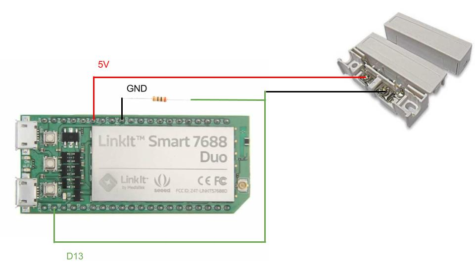
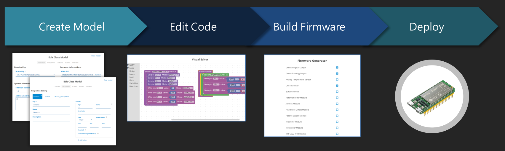
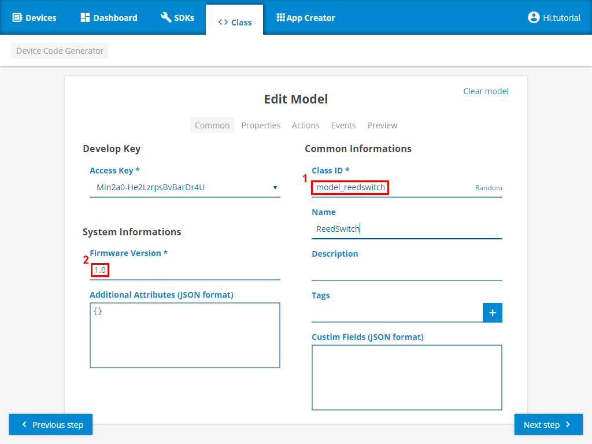
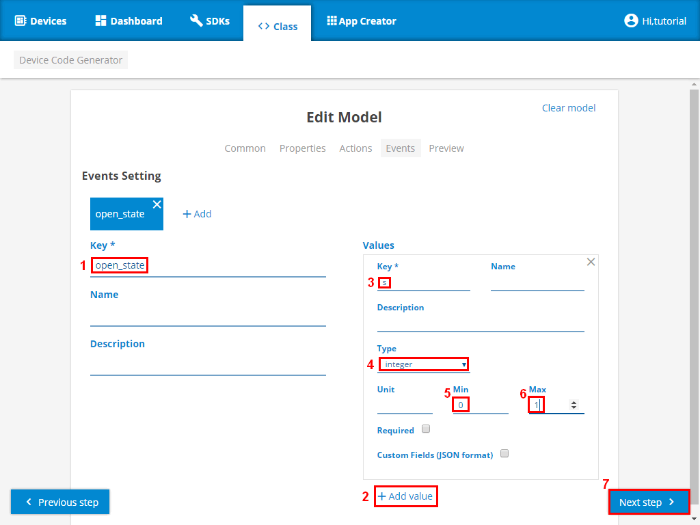
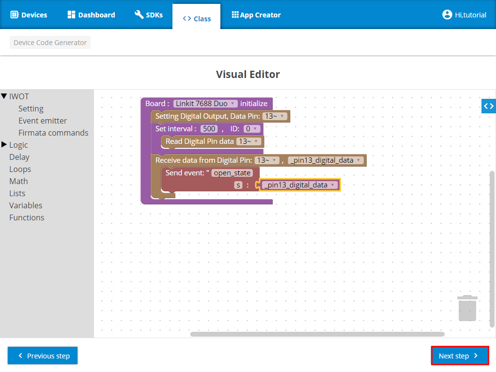
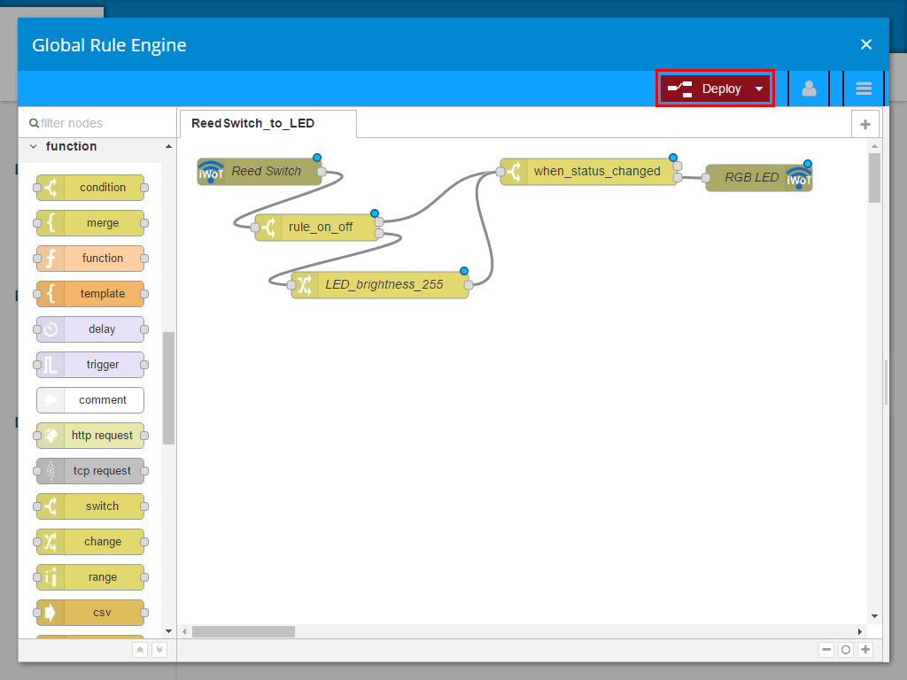
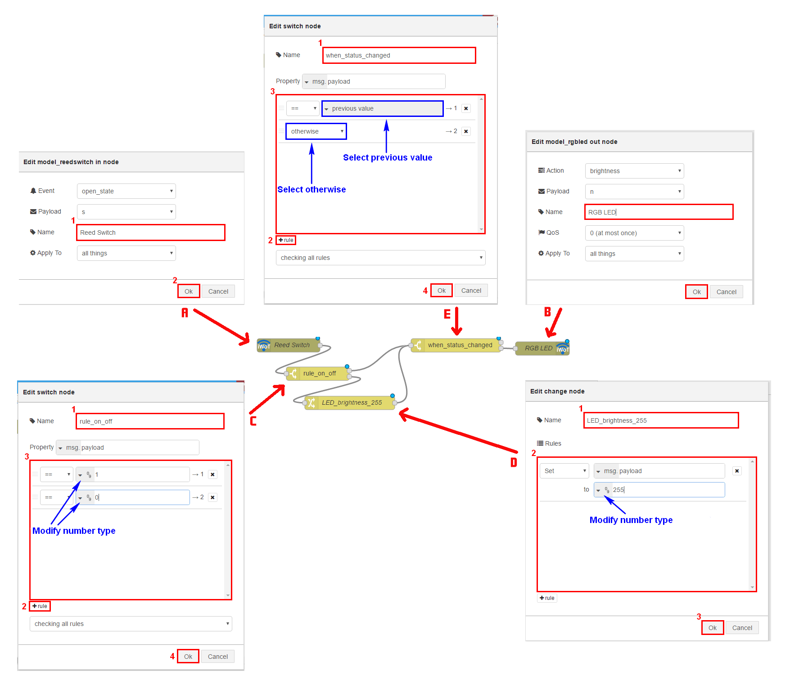

=================================================
102 iWoT 磁簧開關 - 以 LinkIt Smart 7688 Duo 為例
=================================================

    :Date: <2016-12-28 三 20:15>

.. contents::

前置工作
--------

在開始前，您需要先準備下列裝置與電子材料：

- LinkIt Smart 7688 Duo

- 麵包板 × 1(塊)

- 磁簧開關 × 1(組)

- 電阻器 (10K Ω) × 1(個)

- 杜邦線 × 1(包)

磁簧開關線路圖
~~~~~~~~~~~~~~

將 LinkIt Smart 7688 Duo 接上磁簧開關的裝置，其線路圖如下所示：

將磁簧開關的其中一個接點接到 7688 上的 5V 上。另一個磁簧開關接點，GND 串電組接 D13 在接到磁簧開關另一端 ，其作用如下：
將 7688 Dua 上的 5V 接到磁簧開關上其中一個接點。另一組則是將 GND 串電組 (10K Ω) 接到 D13 後在，再接到磁簧開關另一端 ，其作用如下：

- 5V 提供 5V 的電給磁簧開關

- GND 接地

- 電阻器保護電路

- D13 通電訊號偵測

生成 7688 Duo 的 Device ID
~~~~~~~~~~~~~~~~~~~~~~~~~~

參考 `101 生成 7688 Duo 的 Device ID <./101-iWoT-LED.html#make-duo-device-id>`_ 章節

四個步驟建立 iWoT 裝置
----------------------

- 建立 Web Thing Model

- Visual Editor 撰寫 device 控制邏輯

- 線上產生 Arduino Firmware

- 佈署到 iWoT 裝置

建立磁簧開關 Web Thing Model
~~~~~~~~~~~~~~~~~~~~~~~~~~~~

磁簧開關 Web Thing Model 定義 [Common] 與 [Events]。在 [Common] 欄位中需填寫 Class ID、Firmwave Version 這兩個值。由於磁簧開關硬體只有 Event 屬性，在此定義一 ``open_state`` 變數，用 1 ~ 0 表示開關的狀態。

- [Common] 定義 Class ID 及 Firmware Version

- [Events] 定義 ``open_state`` 變數，範圍 1 ~ 0

Visual Editor 撰寫磁簧開關邏輯
~~~~~~~~~~~~~~~~~~~~~~~~~~~~~~

磁簧開關程式撰寫上，主要分兩部份

- 硬體初始化工作

  - D13 設定成數位資料輸出腳位

- 迴圈及控制

  - 設定每 0.5 秒，讀取 D13 現況

  - 將 D13 讀到的結果，以 ``open_state`` 這個變數往 iWoT 傳送

產生 Arduino Firmware
~~~~~~~~~~~~~~~~~~~~~

細節請參考 `101 2.3 產生 Arduino Firmware <./101-iWoT-LED.html#arduino-firmware>`_ 章節

OTA 發佈到 iWoT
~~~~~~~~~~~~~~~

細節請參考 `101 2.4 OTA 發佈到 iWoT <./101-iWoT-LED.html#ota-iwot>`_ 章節

透過 Rule Engine 測試磁簧開關與 LED
-----------------------------------

先前在設定磁簧開關的裝置邏輯是每 500ms 就送一次狀態，因此就算磁簧開關的狀態沒變 LED 燈會不斷的接收磁簧開關的狀態，所以需在 Rule Engine 添加了一些設計邏輯，於 RGB LED 節點前新增一個 switch 元件 (``when_status_changed``)，其用意是當磁簧開關的狀態變更時才送給 RGB LED 節點，如此一來 LED 燈就不會持續收到磁簧開關的狀態。

磁簧開關 Rule Engine 規則詳細內容如下：

1) A 設定磁簧開關 name = ``Reed Switch``

2) B 設定 LED 燈 name = ``RGB LED``

3) C 設定 switch node

   - name = ``rule_on_off``

   - 定義二條邏輯路線 1 -> 1; 0 -> 2

4) D 設定 change node, 把傳進來的值改為 255

5) E 設定 switch node

   - name = ``when_status_change``

   - 傳入相同的值走 1 (濾掉相同的值，讓相同的值無作用)

   - 傳入不同的值走 2

測試磁簧開關與 LED 的動作看看是否正確無誤。如有錯誤請回到 Visual Editor 或 Rule engine 檢查你的程式邏輯。
