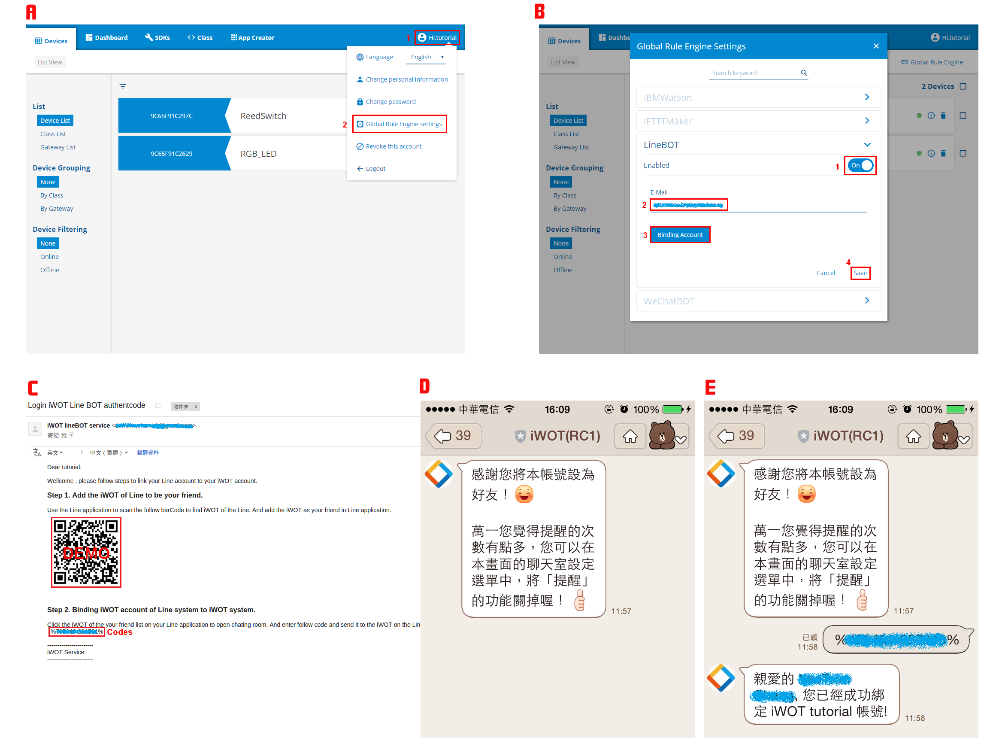
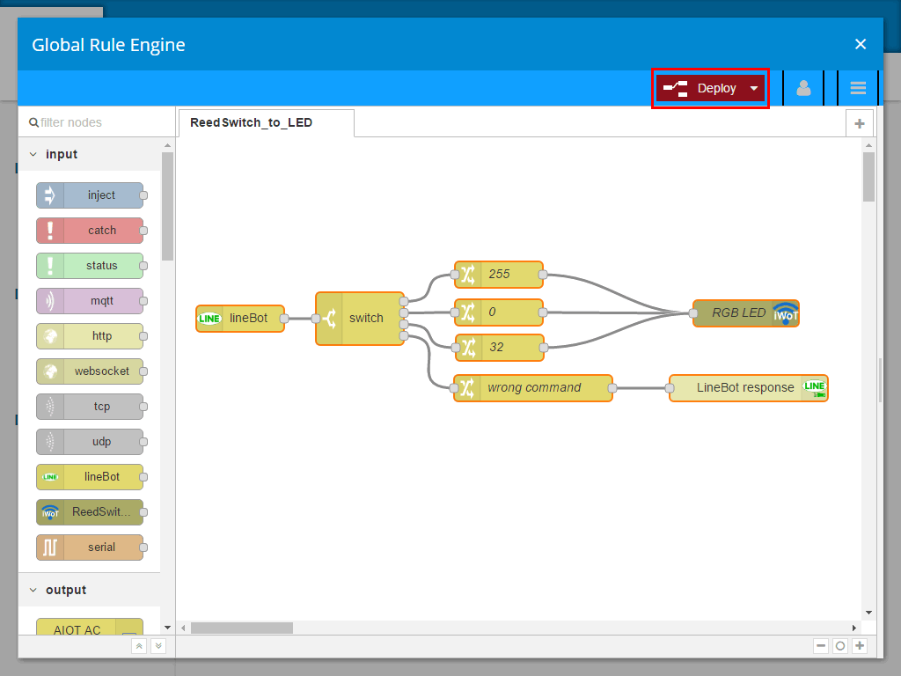
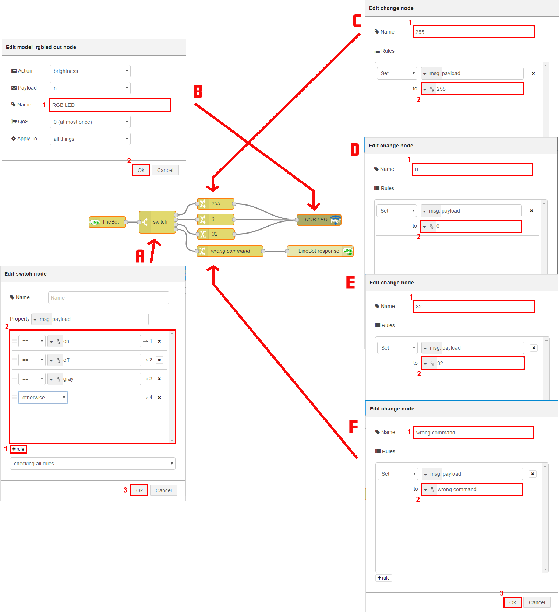
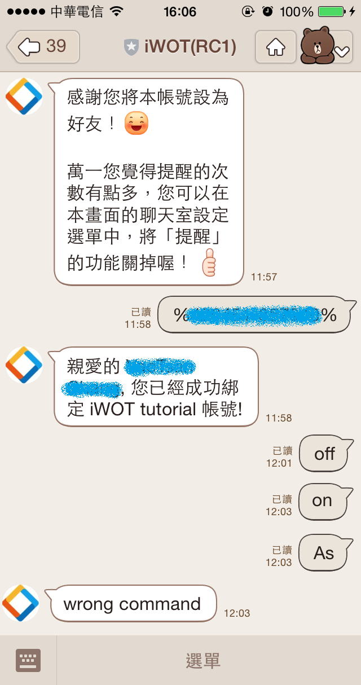

======================================
103 iWoT 透過通訊軟體 LINE 控制 LED 燈
======================================

    :Date: <2016-12-28 三 19:52>

.. contents::

iWoT 整合第三方通訊軟體 (LINE、WeChat)，透過第三方通訊軟體以傳遞訊息方式控制 LED 亮燈行為。

設定 Rule Engine 模組 LineBOT
-----------------------------

A. 在使用者設定點擊 Global Rule Engine settings 打開 LineBOT 功能
#. Enabled 開啟 on，設定 E-Mail 後按下 Binding Account，iWoT 立即會送出認證信件，並且按下 Save 儲存
#. 讀取 iWoT 所寄出的認證信
#. 使用行動裝置開啟第三方通訊軟體 (LINE)，讀取信件內 QR code，加 iWoT 為好友
#. 在 iWoT 好友內輸入信件所提供 Codes，即可成功綁定帳號

設定 Global Rule Engine
-----------------------

接下來設定 Global Rule Engine 讓它搭配 LineBOT 來控制 LED 燈

規則詳細詳述內容如下：

A. 設定 switch node 

- 定義 on 走邏輯路徑 1

- 定義 off 走邏輯路徑 2

- 定義 gray 走邏輯路徑 3

- 定義其它走邏輯路徑 4 (回報錯誤)

B. 定義 LED 燈 name = ``RGB LED``
#. 設定 change node 送出 255
#. 設定 change node 送出 0
#. 設定 change node 送出 32
#. 設定 change node 送出 "wrong command"

測試 LineBot 及 Rule Engine
---------------------------

使用行動裝置開啟第三方通訊軟體(LINE)，根據下列輸入不同的訊息，其對應 Rule Engine 將會控制 LED 裝置作不一樣的行為

- 在 iWoT 好友聊天室輸入 『on』，則 LED 裝置會亮紅燈

- 在 iWoT 好友聊天室輸入 『off』，則 LED 裝置會關燈

- 在 iWoT 好友聊天室輸入 『gray』，則 LED 裝置會亮暗紅燈

- 在 iWoT 好友聊天室輸入其他文字訊息，則 LINE 會回應 wrong command

