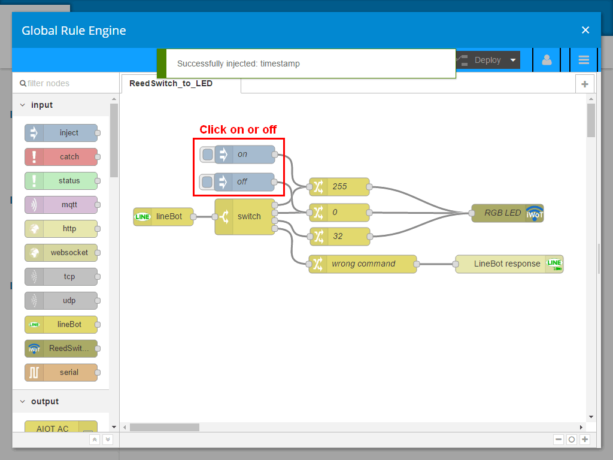
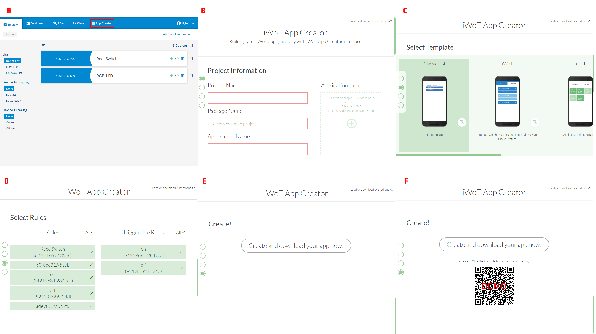
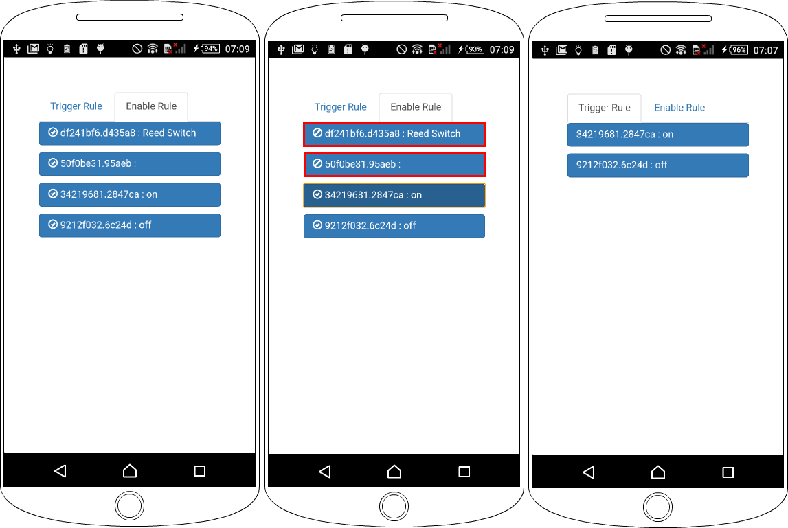

================================
104 iWoT App Creator 控制 LED 燈
================================

    :Date: <2016-12-28 三 19:52>

.. contents::

iWoT 可以快速產生 Android APP，提供使用者可以根據 APP 控制裝置或者 Enable/Disable 裝置的規則。

使用 iWoT 平台控制 LED 燈
-------------------------

延續 103 在 iWoT 的 Global Rule Engine 只要添加了 inject 的節點，則可以在 iWoT 平台使用 Inject 元件手動 Trigger 控制 LED 燈開或者關。

- 設定 inject node; name = ``on``

- 設定 inject node; name = ``off``

產生 App 控制 iWoT 裝置規則
---------------------------

iWoT 可以快速產生 Android APP，提供使用者可以根據 APP 控制裝置或者 Enable/Disable 裝置的規則。

A. 在 iWoT 平台開啟 App Creator
#. 輸入 Project Name、Package Name 以及 Application Name，最後可以上傳 Applicationicon 圖片
#. 選擇 APP 任一內容版面
#. 選擇欲控制開關裝置或 Enable/Disable 裝置規格
#. 按下『Create and download you app now!』按鈕後，等待 iWoT 產生 APP以及提供 APP Ddownload 的 QR Code
#. 使用任一行動裝置(OS 為 Android)，掃描 iWoT 所提供 APP Ddownload 的 QR Code 進行下載安裝

Andord APP UI
-------------

- 在 Enable Rule 頁籤可以 Enable/Disable 裝置規格的按鈕

- 在 Enable Rule 頁籤 Disable 裝置部分規格的按鈕

- 在 Trigger Rule 頁籤，可以自由點擊 on 或 off 控制 LED 燈亮或關

