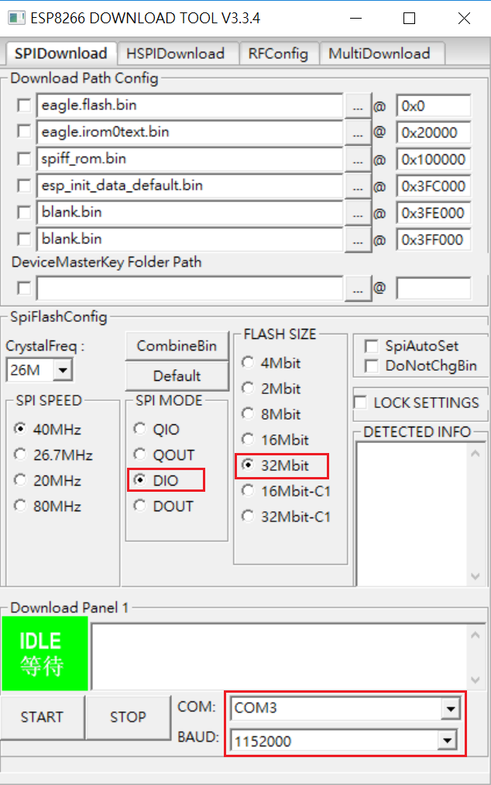

.. -*- mode: rst; time-stamp-start: ":Date:[   ]+\\\\?[\"<]+"; time-stamp-end: "\\\\?[\">]"; time-stamp-format: "%04y/%02m/%02d %02H:%02M" ; -*-

==========================================
105 iWoT 操控光敏電阻 - 以 NodeMCU v3 為例
==========================================

	:Date: <2016/12/31 13:41>

.. contents::

Tutorial 105 106 課程將帶領讀者透過 NodeNCU 開發版實作並操控光敏電阻及風扇馬達

前置工作
========

在開始前，您需準備下列裝置與電子材料：

- NodeMCU v3
- NodeMCU 擴展板
- 光敏電阻 Grove-Light Sensor

準備開發環境
============

NodeMCU 剛買回來需燒錄 iWoT firmware 並產生一組不重複的 ID 對應於 iWoT 上，其步驟如下：

下載及燒錄 firmware
-------------------

- iWoT firmware ``缺下載點``
- `Usb driver [載點] <http://www.wch.cn/download/CH341SER_ZIP.html>`_ 
- `Esp8266 燒錄程式 [載點] <https://espressif.com/en/tools-type/flash-download-tools>`_

iWoT firmware 檔案下載下來會有幾個檔案分別為

.. table::

    +------------------------------+-------------------------------+
    | 檔案                         | 說明                          |
    +==============================+===============================+
    | esptool.py                   | esp8266 python 版燒錄程式     |
    +------------------------------+-------------------------------+
    | eagle.irom0text.bin          | iWoT firmware 程式            |
    +------------------------------+-------------------------------+
    | eagle.flash.bin              | esp8266 系統開機程式          |
    +------------------------------+-------------------------------+
    | spiff_rom.bin                | iWoT firmware 資料區/檔案系統 |
    +------------------------------+-------------------------------+
    | blank.bin                    | 空資料                        |
    +------------------------------+-------------------------------+
    | esp_init_data_default.bin    | Wifi 射頻資料 firmware        |
    +------------------------------+-------------------------------+

按照下表設定將檔案燒到指定位置

.. table::

    +-------------------------------+----------+------------------+
    | 檔案                          |     位置 | 註解             |
    +===============================+==========+==================+
    | eagle.flash.bin               |      0x0 | 系統開機區       |
    +-------------------------------+----------+------------------+
    | blank.bin                     |  0x1F000 | ``可以不用燒錄`` |
    +-------------------------------+----------+------------------+
    | eagle.irom0text.bin           |  0x20000 | iWoT 程式區      |
    +-------------------------------+----------+------------------+
    | spiff_rom.bin                 | 0x100000 | iWoT 資料區      |
    +-------------------------------+----------+------------------+
    | esp_init_data_default.bin     | 0x3FC000 | Wifi 射頻初始值  |
    +-------------------------------+----------+------------------+
    | blank.bin                     | 0x3FE000 | 清空資料         |
    +-------------------------------+----------+------------------+
    | blank.bin                     | 0x3FF000 | 清空資料         |
    +-------------------------------+----------+------------------+

如圖所示

設定 NodeMCU 連上網路產生 Device ID
-----------------------------------

燒錄完成後斷電重開，NodeMCU 會變成 AP mode。此時使用手機或電腦搜尋無線網路，將會發現以 ``EspXXXX-XXXX-XXXX`` 格式命名的 Wifi AP 。

- 設定手機/電腦連結到 NodeMCU Wifi AP

::

  SSID:EspXXXX-XXXX-XXXX
  密碼:12345678

- 設定 NodeMCU 連上 Internet，並抄錄 Device ID

連結上 AP 之後， 開啟瀏覽器輸入 http://192.168.4.1 設定 NodeMCU wifi 讓它連結上 Internet ，並記錄下 Device ID

如圖所示

三個步驟建立 iWoT 裝置
======================

.. image:: ../L1/images-101/make-iwot-device-4-steps.png
    :alt: 4 steps Make a iWoT device
    :align: center

- 建立 Web Thing Model
- Visual Editor 撰寫 device 控制邏輯
- 佈署到 iWoT 裝置

建立光敏電阻 Web Thing Model
-----------------------------

關於 光敏電阻 的 Web Thing Model 定義，主要填寫 [Common] 與 [Event] 這二項。[Common] 欄位中必需填寫 Class ID、Firmwave Version 這兩個值。定義光敏電阻 light_value 亮度這個變數，其亮度範圍介於 0 ~ 255 之間。

- [Common] 定義 Class ID 及 Firmware Version

- [Event] 定義 light_value 這個變數，範圍 0 ~ 255

Visual Editor 撰寫光敏電阻控制邏輯
----------------------------------

- 硬體初始化工作

   - A0 為類比資料輸出腳位
   
- 迴圈及控制

  - 設定每 0.2 秒，讀取 A0 現況 
  - 將 A0 讀到的結果，透過 light_value 變數往 iWoT 傳送

程式邏輯如下圖：

OTA 發佈到 iWoT
---------------

上述撰寫的程式邏輯將透過 OTA 發佈到 iWoT 的裝制上，這過程需要數分鐘的時間。OTA 完成後，將會在 iWoT 平台的上看見它出現在 device 列表中。詳細步驟如下：

1. 將 Device ID 加到 model_esp8266_ligt Class (輸入先前準備工作所記錄下來的裝置 ID)
2. 在 iWoT 平台 Devices 列表頁面，看見裝置已經成功連上

**將 Device ID 加到 Light Sensor Class**

**Light Sensor 出現於裝置列表上**

透過 Rule Engine 測試光敏電阻及風扇
===================================

可透過右邊的 Debug 看到，光敏電阻 light_value 變數的變化值。 

最後我們可以透過 Rule Engine 光敏電阻的動作看看是否正確無誤。如有錯誤請回到 Visual Editor 檢查你的程式邏輯，也可透過再次修改 Visual Editor 來重新改寫控制邏輯。

接下來的 106 將介紹如何控制風扇並與光敏電阻進行互動。

