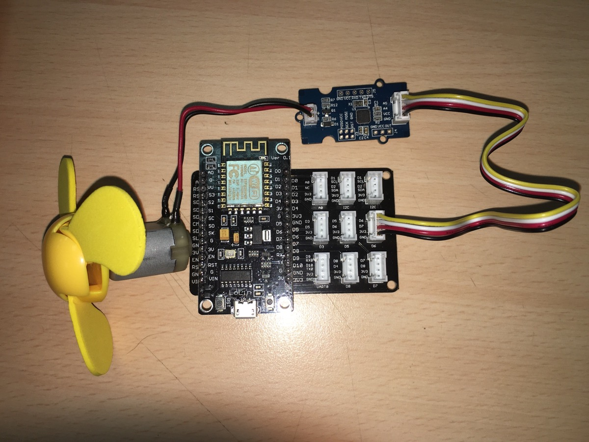
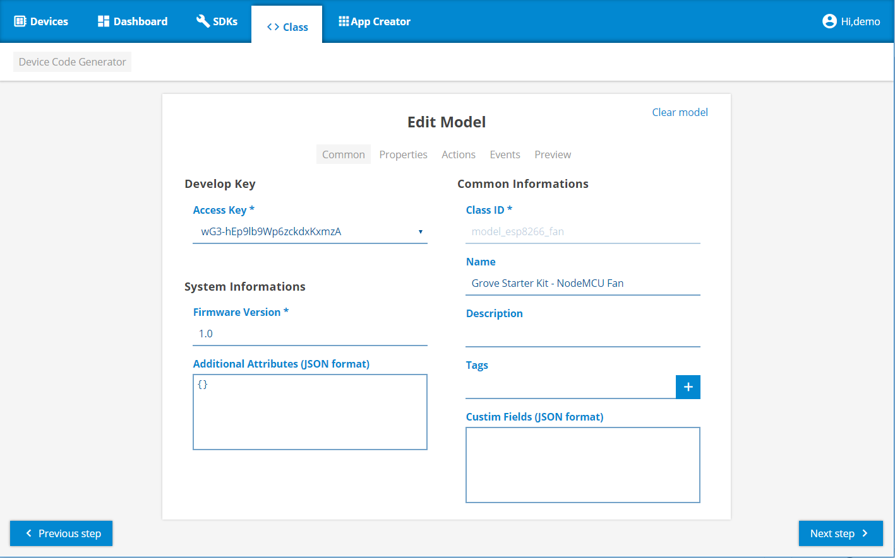
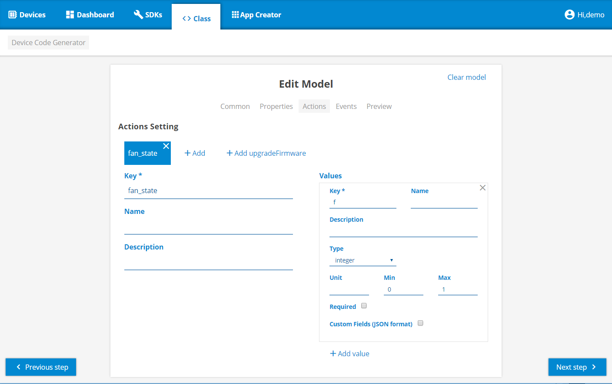
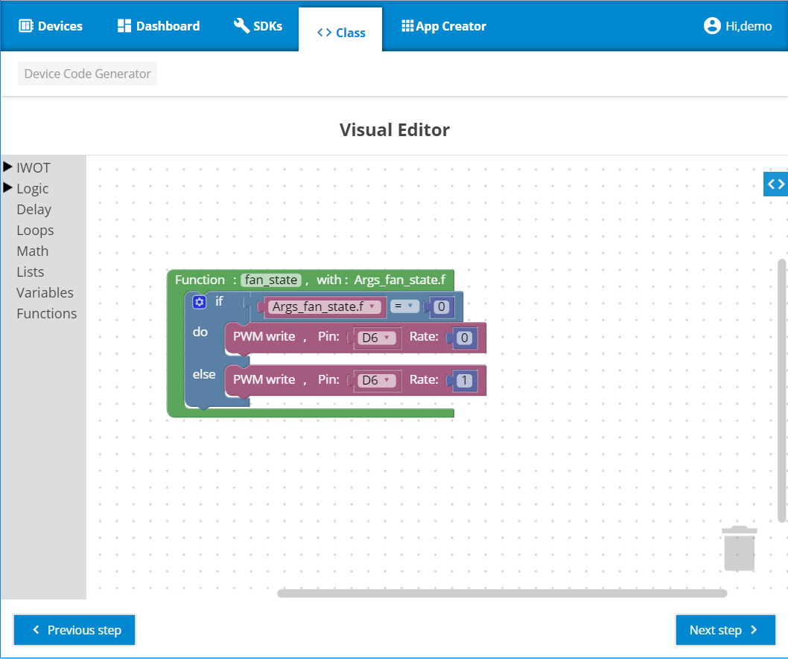
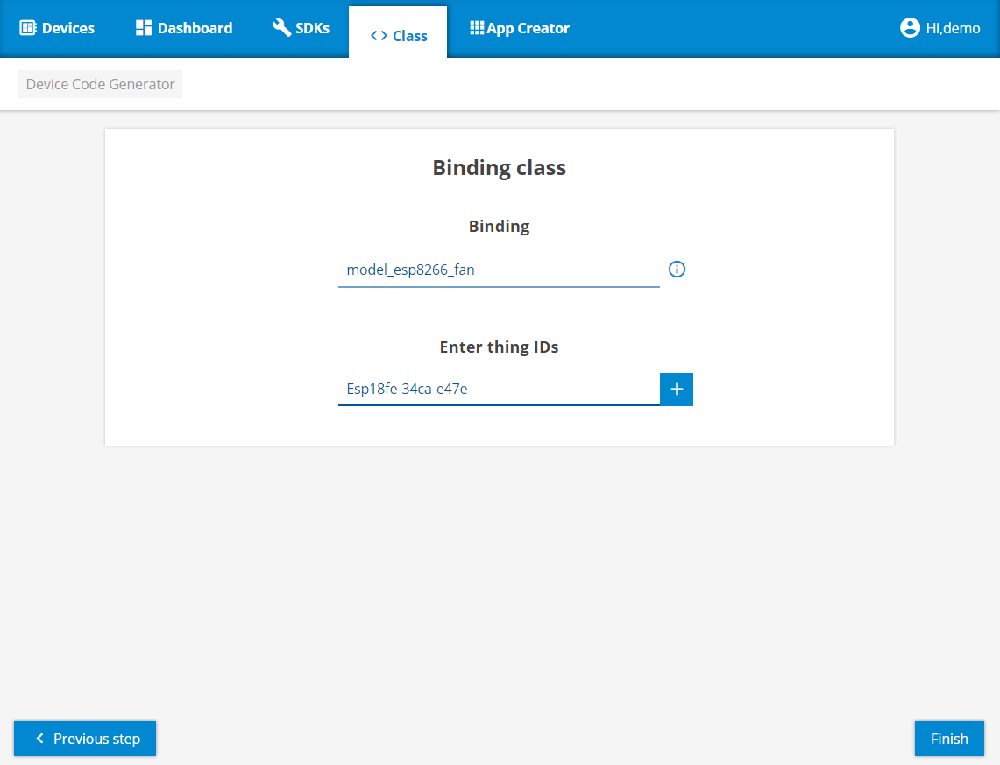
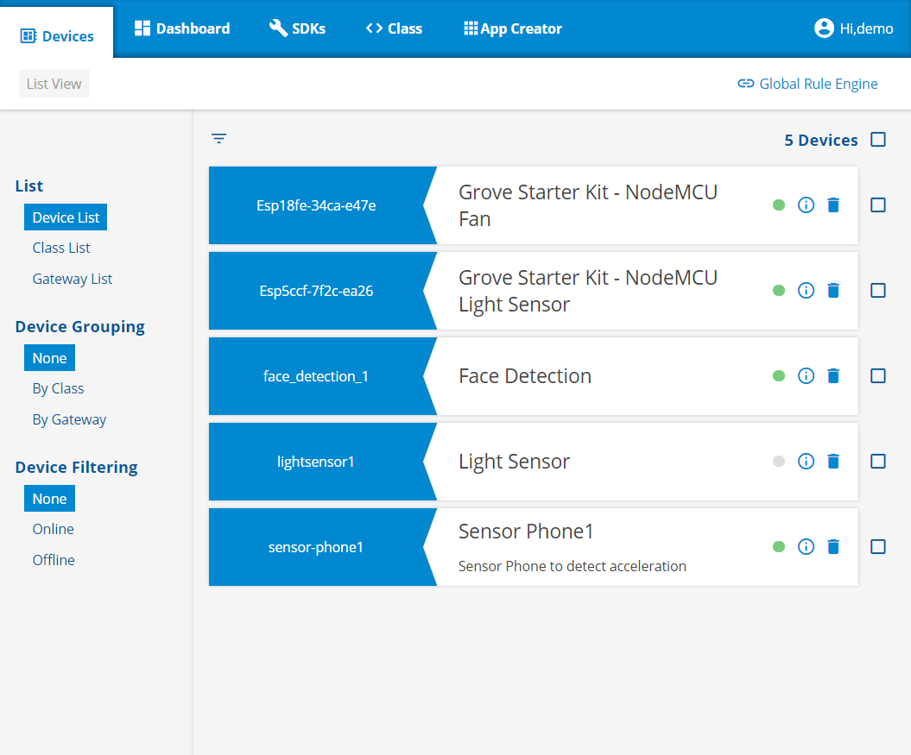
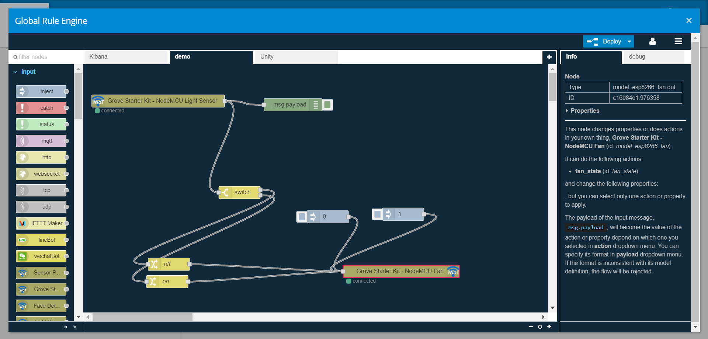

.. -*- mode: rst; time-stamp-start: ":Date:[   ]+\\\\?[\"<]+"; time-stamp-end: "\\\\?[\">]"; time-stamp-format: "%04y/%02m/%02d %02H:%02M" ; -*-

===================================================
106 iWoT 光敏電阻與風扇的互動 - 以 NodeMCU v3  為例
===================================================

	:Date: <2016/12/31 13:40>

.. contents::

Tutorial 106 課程將帶領讀者實作來操控光敏電阻與電扇間的互動

前置工作
========

在開始前，您需準備下列裝置與電子材料：

- NodeMCU v3
- NodeMCU 擴展板
- 風扇 Grove-mini fan

準備開發環境
============

`詳 105 準備開發環境 <./105-iWoT-Photosensitive-resistor-NodeMCU-V3.html#id2>`_

三個步驟建立 iWoT 裝置
======================

.. image:: ../L1/images-101/make-iwot-device-4-steps.png
    :alt: 4 steps Make a iWoT device
    :align: center

- 建立 Web Thing Model
- Visual Editor 撰寫 device 控制邏輯
- 佈署到 iWoT 裝置

建立風扇 Web Thing Model
------------------------

關於 **風扇** 的 Web Thing Model 定義，主要填寫 [Common] 與 [Action] 這二項。[Common] 欄位中必需填寫 Class ID、Firmwave Version 這兩個值。
定義風扇 ``fan_state`` 這個變數，其數值為 0 或 1。

- [Common] 定義 Class ID 及 Firmware Version

- [Actions] 定義 ``fan_state`` 這個變數，為 0 或 1

Visual Editor 撰寫風扇控制邏輯
------------------------------

- 硬體初始化工作

  - 設定 D6 為接收資料的輸入腳位
   
- 控制

  - 根據 iwot 接收到 fan_state 的值來控制風扇的開啟及關閉
  

程式邏輯如下圖：

OTA 發佈到 iWoT
---------------

上述撰寫的程式邏輯將透過 OTA 發佈到 iWoT 的裝置上，過程需要數分鐘的時間。OTA 完成後，將會在 iWoT 平台的上看見它出現在 device 列表中。詳細步驟如下：

- 將 Device ID 加到 model_esp8266_fan Class (輸入先前準備工作所記錄下來的裝置 ID)

- 在 iWoT 平台 Devices 列表頁面，看見裝置已經成功連上

**將 Device ID 加到 Fan Class**

**把光敏電阻和風扇都接上 Fan 和 Light 都出現於裝置列表上**

透過 Rule Engine 測試光敏電阻及風扇
====================================

最後我們可以透過 Rule Engine 光敏電阻及風扇的動作看看是否正確無誤。如有錯誤請回到 Visual Editor 檢查你的程式邏輯，也可透過再次修改 Visual Editor 來重新改寫控制邏輯。
